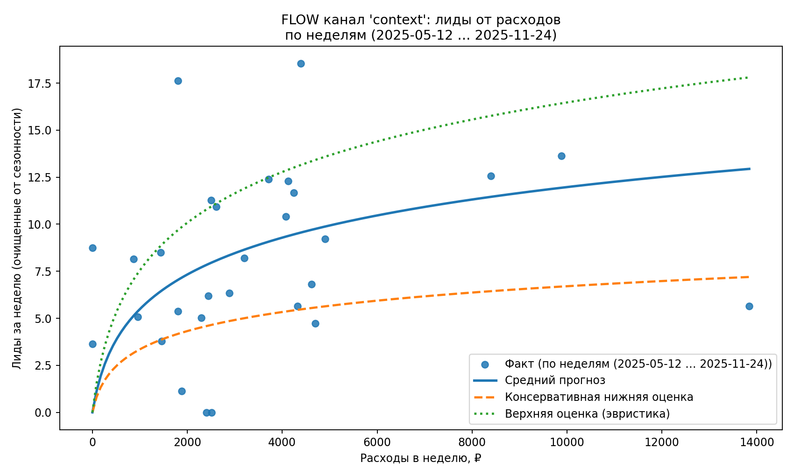
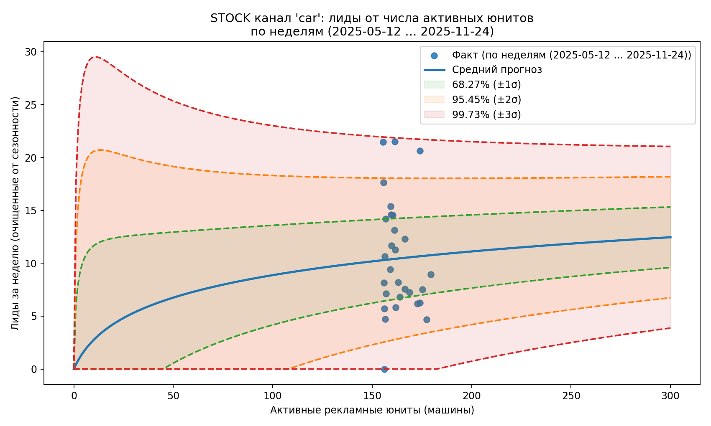

# Hierarchical MMM (Flow & Stock) — Probabilistic MVP

Прототип **вероятностной Marketing Mix Model (MMM)** для прогнозирования лидов и поддержки решений по рекламному бюджету с явным разделением каналов на два типа:

- **Flow** — быстрые каналы (контекст / диджитал), эффект почти мгновенный, возможен короткий adstock-хвост.
- **Stock** — “долгие” каналы (например, брендированные автомобили), где эффект создаётся активными рекламными юнитами и накапливается стохастически.

Проект ориентирован на:
- интерпретируемость,
- робастность,
- консервативные нижние оценки для принятия решений,
- явное моделирование неопределённости для Stock-каналов.

---

## Обзор задачи

В реальных маркетинговых системах разные каналы ведут себя принципиально по-разному:

- одни реагируют сразу на расходы (Flow),
- другие накапливают эффект со временем через экспозицию и “память” (Stock).

Большинство классических MMM смешивают эти механизмы в одной регрессии, что приводит к:
- нестабильным оценкам,
- плохой экстраполяции,
- и ошибочным решениям при оптимизации бюджета.

В этом проекте строится **структурная модель**:
- Flow моделируется как насыщаемая функция от расходов,
- Stock — как стохастический процесс накопления с доверительными интервалами.

Цель — не только прогноз, но и **поддержка робастных управленческих решений в условиях неопределённости**.

---

## Идея модели

### 1) Flow-каналы (быстрые)

Зависимость лидов от эффективных расходов с насыщением:

R(x) = a · ln(1 + b · E(x))

Где:
- x — расходы за неделю,
- E(x) — эффективный бюджет с учётом adstock,
- a, b — параметры насыщения,
- λ — коэффициент затухания adstock (подбирается по сетке).

Дополнительно строятся:
- средняя кривая,
- консервативная нижняя оценка,
- верхняя оценка (эвристически).

---

### 2) Stock-каналы (долгие)

Каждый рекламный юнит (например, машина) создаёт случайное число “касания”.

Обозначим:
- S — число активных юнитов,
- X — суммарные касания за неделю (скрытая величина),
- X | S ≈ Normal(S·μ, S·σ²) (по ЦПТ).

Лиды получаются через логарифмическую конверсию:

Y = a · ln(1 + b · X)

Из этого строятся:
- средняя кривая,
- вероятностные коридоры ±1σ, ±2σ, ±3σ  
  (68.27%, 95.45%, 99.73%).

Примечания:
- μ фиксируется (иначе масштаб неидентифицируем),
- σ калибруется по росту разброса через дельта-метод.

---

## Результаты (пример: датасет Caravan)

### Flow канал: контекст



Интерпретация:
- ярко выраженное насыщение,
- убывающая отдача от расходов,
- нижняя оценка используется для безопасного планирования.

---

### Stock канал: брендированные машины



Интерпретация:
- высокая неопределённость при малых объёмах,
- сходимость при росте числа юнитов,
- явные коридоры риска для управленческих решений.

---

## Пайплайн (в общих чертах)

1. Загрузка датасета по имени (из папки `data/`)
2. Сбор общего weekly-контекста
3. Оценка сезонности и очистка лидов
4. Fit Flow моделей (λ, a, b + границы)
5. Fit Stock моделей (CLT + σ-интервалы)
6. Построение графиков и вывод параметров

---

## Структура проекта

- main.py # интерактивная точка входа
- core/ # preprocessing, seasonality, model fitting
- pipelines/ # сценарии запуска (forecast_channel и др.)
- data/ # датасеты (каждый в отдельной папке)
- save_images/ # сохранённые графики

---

## Быстрый запуск

```bash
pip install -r requirements.txt
python main.py
